[README.md](https://github.com/user-attachments/files/33180516/README.md)
<div align="center">

# 🚀 StageLink Backend

**A smart internship management platform powered by a secure REST API, real-time communication, document management, statistics, and AI-powered knowledge assistance.**


</div>

---

## 📑 Table of Contents

- [Overview](#-overview)
- [Problem Statement](#-problem-statement)
- [Solution](#-solution)
- [Key Features](#-key-features)
- [System Architecture](#️-system-architecture)
- [Layered Architecture](#-backend-layered-architecture)
- [Request Lifecycle](#-request-lifecycle)
- [User Roles](#-user-roles)
- [Registration & Validation Workflow](#-registration--validation-workflow)
- [Authentication Architecture](#-authentication-architecture)
- [Document Management](#-document-management-architecture)
- [Appointments & Notifications](#-appointment--notification-workflow)
- [Real-Time Chat](#-real-time-chat-architecture)
- [AI & RAG Architecture](#-ai--rag-architecture)
- [Database Architecture](#️-database-architecture)
- [Security Architecture](#️-security-architecture)
- [Project Structure](#-backend-project-structure)
- [API Architecture](#-api-architecture)
- [Testing](#-testing)
- [Deployment](#️-deployment-architecture)
- [Environment Variables](#️-environment-variables)
- [Installation](#-installation)
- [Technology Stack](#-technology-stack)
- [Future Improvements](#-future-improvements)
- [Author](#-author)
- [License](#-license)

---

## 📌 Overview

**StageLink** is an internship management platform designed to centralize and simplify the management of internships, companies, supervisors, interns, documents, appointments, tasks, communication, and academic projects.

This repository contains the **backend** of StageLink, developed with **Node.js** and **Express.js**.

| Capability | Description |
|---|---|
| 🔌 **RESTful APIs** | Structured endpoints organized by functional domain |
| 🔐 **Auth & RBAC** | JWT, refresh tokens, OTP, Google OAuth, role-based access control |
| 🏢 **Internship management** | Companies, interns, supervisors, conventions |
| 📄 **Documents** | Upload, versioning, review and approval workflow |
| 📅 **Appointments** | Request, validation and notification workflow |
| 💬 **Real-time** | Messaging, presence, typing indicators, notifications |
| 📊 **Statistics** | Platform-wide analytics |
| ☁️ **Cloud storage** | Files stored on Cloudinary |
| 🤖 **AI / RAG** | Semantic search, Q&A, summarization, project comparison |
| 📘 **Documentation** | Swagger / OpenAPI |
| 🧪 **Tests** | Automated backend tests |

> **Backend responsibility:** Liliana Amrani  
> **Frontend:** developed separately by the project team.

---

## 🎯 Problem Statement

Internship management involves many actors and many disconnected processes.

```mermaid
flowchart LR
    subgraph ACTORS["Actors"]
        direction TB
        A1["Companies"]
        A2["Administrators"]
        A3["Supervisors"]
        A4["Interns"]
    end

    subgraph PROCESSES["Disconnected processes"]
        direction TB
        P1["Internship conventions"]
        P2["Academic documents"]
        P3["Appointments"]
        P4["Tasks and activities"]
        P5["Messages and notifications"]
        P6["Final reports and theses"]
    end

    ACTORS -. "scattered tools<br/>emails, files, spreadsheets" .-> PROCESSES
    PROCESSES --> RESULT["Information is hard to<br/>organize, track, validate<br/>and retrieve"]

    classDef actor fill:#e0f2fe,stroke:#0284c7,stroke-width:1.5px,color:#0c4a6e
    classDef process fill:#fef3c7,stroke:#d97706,stroke-width:1.5px,color:#78350f
    classDef problem fill:#fee2e2,stroke:#dc2626,stroke-width:2px,color:#7f1d1d

    class A1,A2,A3,A4 actor
    class P1,P2,P3,P4,P5,P6 process
    class RESULT problem
```

---

## 💡 Solution

StageLink provides a **centralized backend architecture** connecting all major internship-management components through structured APIs and intelligent services.

```mermaid
flowchart TB
    CORE(["StageLink<br/>Backend"])

    subgraph SEC["Security"]
        direction TB
        S1["Authentication"]
        S2["Authorization"]
    end

    subgraph ENT["Entities"]
        direction TB
        E1["Companies"]
        E2["Interns"]
        E3["Supervisors"]
    end

    subgraph WORK["Workflows"]
        direction TB
        W1["Documents"]
        W2["Appointments"]
        W3["Tasks and Activities"]
    end

    subgraph COM["Communication"]
        direction TB
        C1["Messages"]
        C2["Notifications"]
    end

    subgraph INS["Intelligence"]
        direction TB
        I1["Statistics"]
        I2["AI Knowledge Layer"]
    end

    CORE --> SEC
    CORE --> ENT
    CORE --> WORK
    CORE --> COM
    CORE --> INS

    classDef core fill:#1e3a8a,stroke:#1e40af,stroke-width:2px,color:#ffffff
    classDef sec fill:#fce7f3,stroke:#db2777,color:#831843
    classDef ent fill:#e0f2fe,stroke:#0284c7,color:#0c4a6e
    classDef work fill:#dcfce7,stroke:#16a34a,color:#14532d
    classDef com fill:#fef3c7,stroke:#d97706,color:#78350f
    classDef ins fill:#ede9fe,stroke:#7c3aed,color:#4c1d95

    class CORE core
    class S1,S2 sec
    class E1,E2,E3 ent
    class W1,W2,W3 work
    class C1,C2 com
    class I1,I2 ins
```

---

## ✨ Key Features

<table>
<tr>
<td width="50%" valign="top">

### 🔐 Authentication & Security
- JWT-based authentication
- Access and refresh tokens
- Password hashing with bcrypt
- Email OTP verification
- Password reset mechanism
- Google OAuth authentication
- Role-based authorization
- Protected routes
- Input validation
- Centralized error handling

### 👥 User & Role Management
- `SUPER_ADMIN`
- `SECONDARY_ADMIN`
- `SUPERVISOR`
- `INTERN`

Each role has its own permissions and responsibilities.

### 🏢 Company Management
- Company registration
- Company approval
- Company information management
- Company logo upload
- Company-level administration

### 🎓 Internship Management
- Intern registration
- PFE / PFC internship types
- Convention management
- Supervisor assignment
- Internship status management
- Intern / supervisor relationships

</td>
<td width="50%" valign="top">

### 📄 Document Management
- Document upload
- Document versions
- Document reviews
- Approval workflow
- Academic project documents
- PDF text extraction
- Document indexing for AI search

### 📅 Appointment Management
- Appointment creation
- Supervisor validation
- Accept / reject workflow
- Pending appointments
- In-person / video appointments
- Notifications

### 💬 Real-Time Communication (Socket.IO)
- Real-time messaging
- Conversation management
- Online status
- Typing indicators
- Real-time notifications

### 📊 Statistics
- Internships
- Users
- Companies
- Supervisors
- Activities
- Other platform entities

### 🤖 AI Knowledge Assistant
- Semantic search
- RAG-based question answering
- Document summarization
- Similar project search
- Project comparison
- Embedding generation
- Vector similarity search
- Retrieval from validated academic documents

</td>
</tr>
</table>

---

## 🏗️ System Architecture

The backend acts as the **central application layer** between the client and external infrastructure.

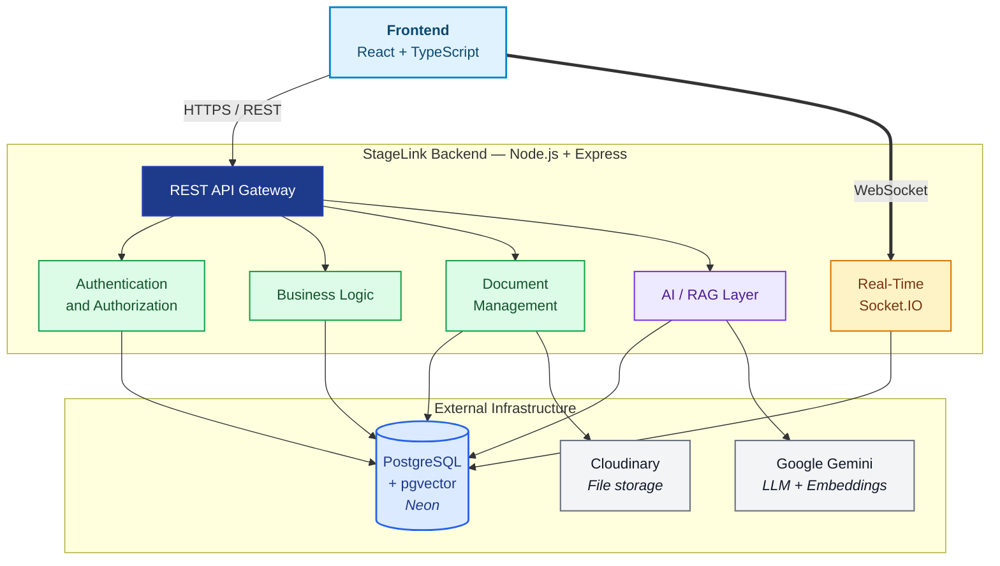

---

## 🧱 Backend Layered Architecture

The backend follows a layered organization separating HTTP routing, business logic, data access, security, and external services.

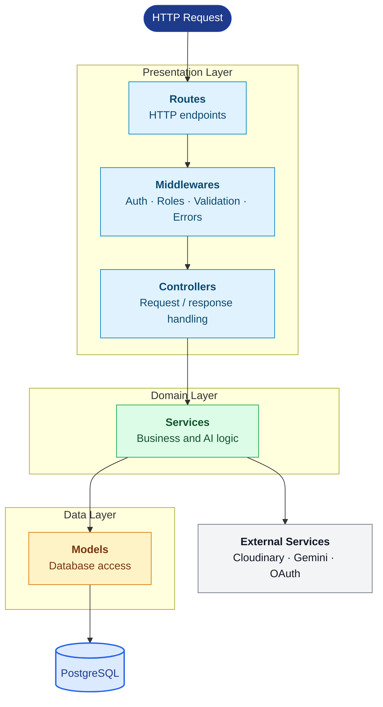

### Responsibilities

| Layer | Responsibility |
|---|---|
| **Routes** | Define API endpoints |
| **Middleware** | Authentication, authorization, validation and error handling |
| **Controllers** | Handle HTTP requests and responses |
| **Services** | Business logic and AI operations |
| **Models** | Database operations |
| **Sockets** | Real-time communication |
| **Utils** | Shared utilities and helpers |

---

## 🔄 Request Lifecycle

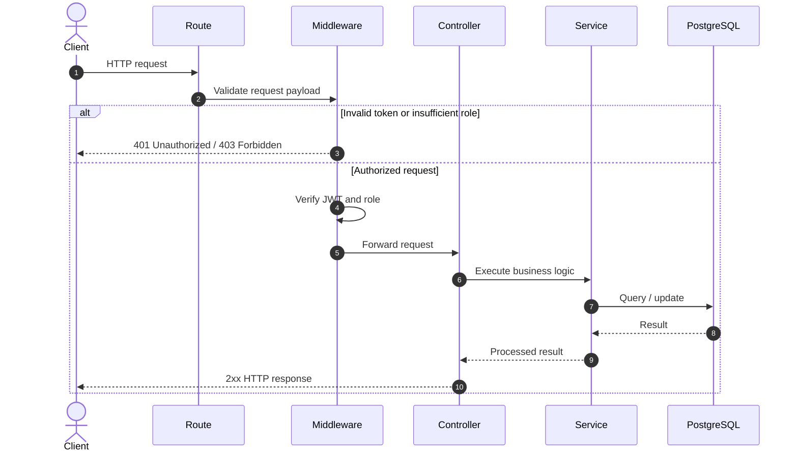

This separation makes the backend easier to **maintain, test, and extend**.

---

## 👥 User Roles

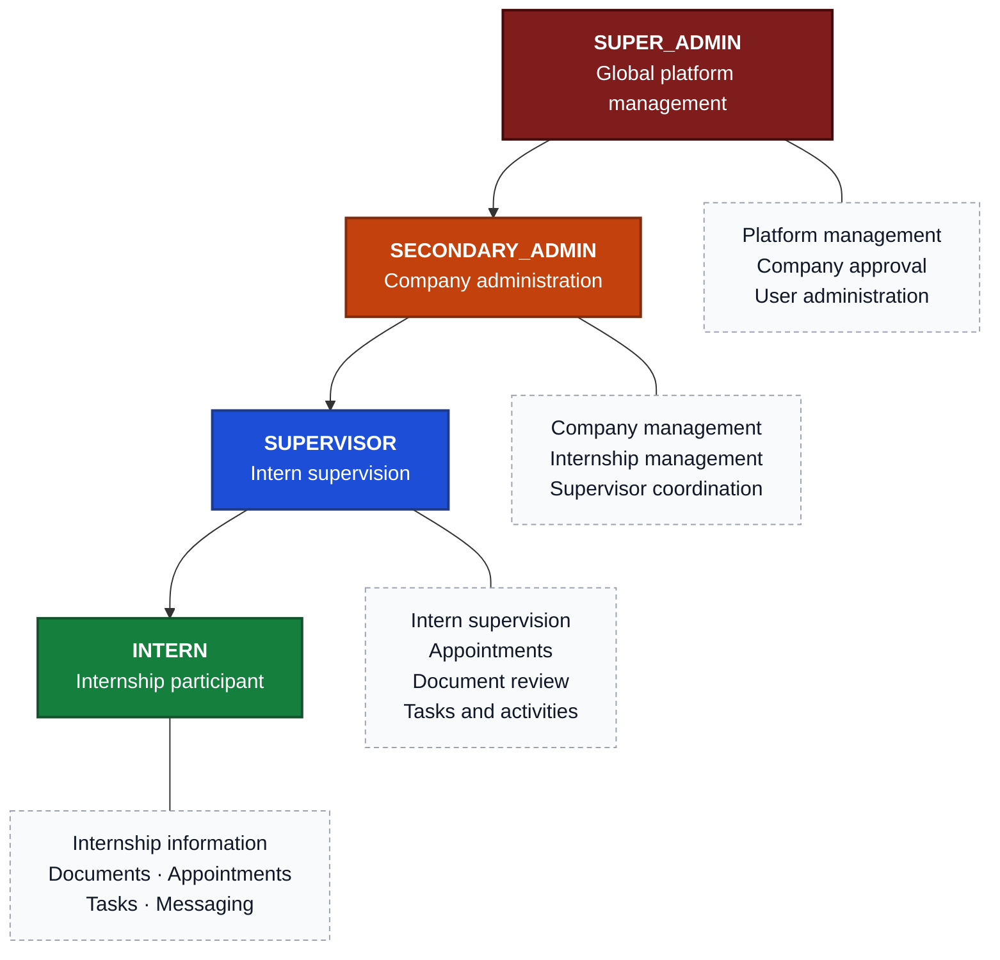

---

## 📝 Registration & Validation Workflow

StageLink uses **validation workflows** instead of immediately granting access to every newly registered entity.

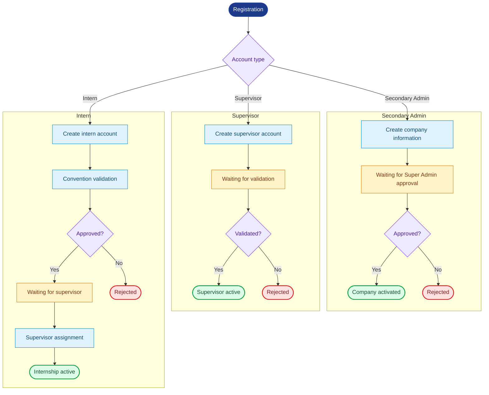

---

## 🔐 Authentication Architecture

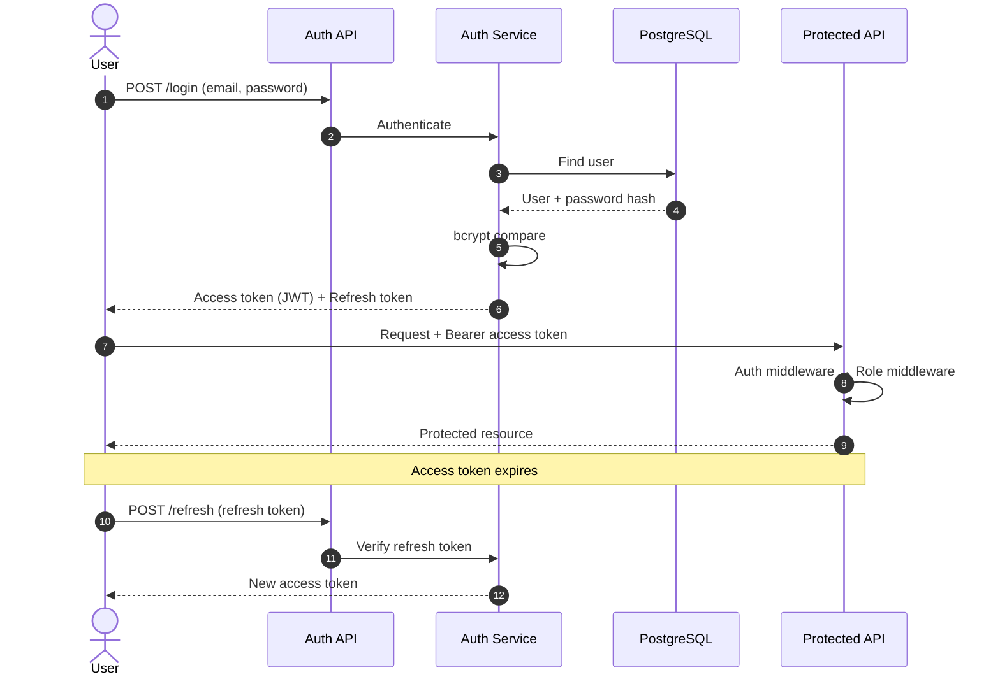

### Security mechanisms

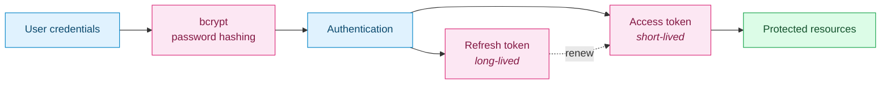

Additional mechanisms: **bcrypt hashing · JWT validation · role-based authorization · email OTP · password reset tokens · Google OAuth · request validation · centralized error handling**.

---

## 📄 Document Management Architecture

Documents are **not treated as simple file uploads** — StageLink manages their full lifecycle.

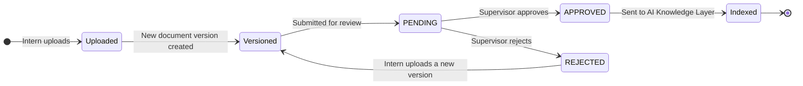

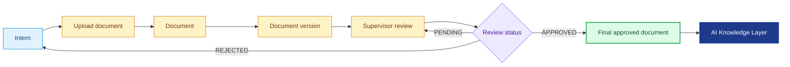

> This workflow allows the AI layer to rely on **validated academic content** instead of blindly retrieving arbitrary documents.

---

## 📅 Appointment & Notification Workflow

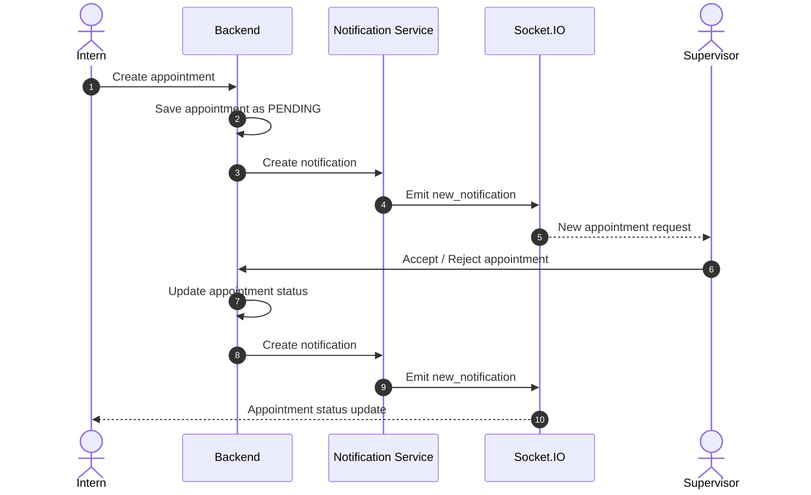

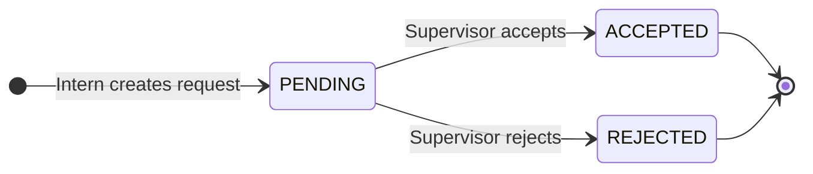

Supported appointment types: `PRESENTIEL` · `VISIO`

---

## 💬 Real-Time Chat Architecture

StageLink uses **Socket.IO** for real-time communication.

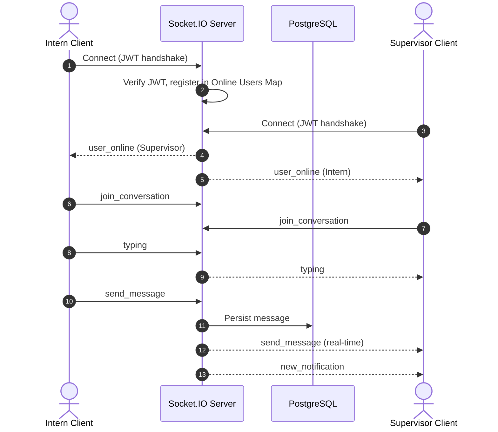

| Event | Purpose |
|---|---|
| `user_online` | Presence / online status |
| `join_conversation` | Join a conversation room |
| `send_message` | Send and broadcast a message |
| `typing` | Typing indicator |
| `new_notification` | Push a real-time notification |

---

## 🤖 AI & RAG Architecture

One of the main advanced components of StageLink is its **AI-powered knowledge layer**.

The objective is not simply to send a question directly to an LLM. Instead, StageLink retrieves **relevant validated academic information** and uses it as contextual knowledge.

### End-to-end pipeline

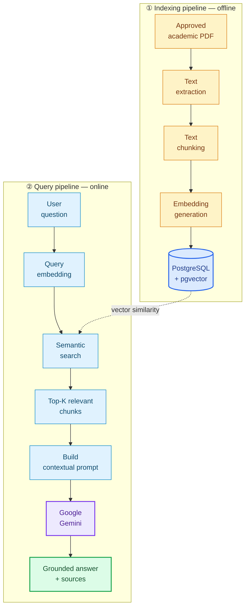

### RAG sequence

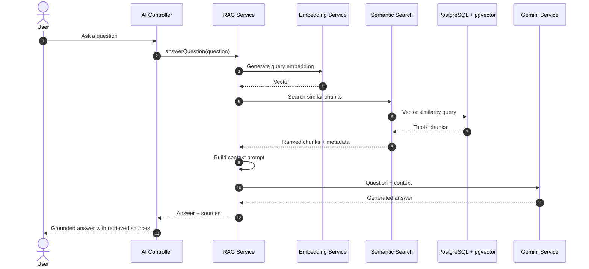

### Semantic search

StageLink uses **vector similarity** to retrieve semantically related content, so it can find information based on **meaning**, not only exact keyword matching.

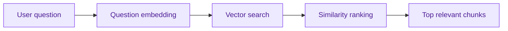

### AI services

```
src/services/ai/
├── documentSummaryService.js
├── embeddingIndexService.js
├── embeddingService.js
├── geminiService.js
├── projectComparisonService.js
├── ragService.js
└── semanticSearchService.js

src/utils/ (supporting utilities)
├── chunker.js
├── cosineSimilarity.js
└── textExtractor.js
```

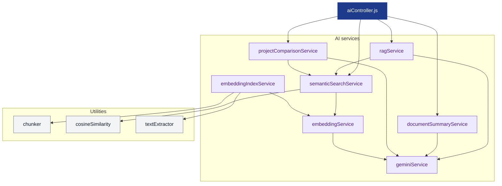

| Service | Purpose |
|---|---|
| **Embedding Service** | Generate vector representations |
| **Embedding Index Service** | Index documents |
| **Semantic Search Service** | Retrieve relevant content |
| **RAG Service** | Generate contextual answers |
| **Gemini Service** | Communicate with Gemini |
| **Document Summary Service** | Summarize academic documents |
| **Project Comparison Service** | Compare and find similar projects |

---

## 🗄️ Database Architecture

StageLink uses **PostgreSQL** as its primary database, storing the platform's core entities and AI-related information.

> This diagram represents the **conceptual** relationships of the application. Exact database relationships should be synchronized with the current model definitions.

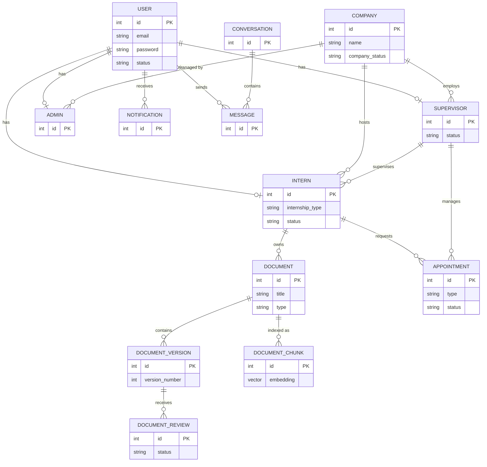

### AI data flow

The database also acts as the **bridge** between document management and the AI layer.

```mermaid
flowchart LR
    DOCUMENT["Approved<br/>academic document"] --> VERSION["Document<br/>version"]
    VERSION --> EXTRACT["Text<br/>extraction"]
    EXTRACT --> CHUNKS["Document<br/>chunks"]
    CHUNKS --> EMB["Embeddings"]
    EMB --> VECTOR[("pgvector")]
    VECTOR --> SEARCH["Semantic<br/>search"]
    SEARCH --> RAG["RAG<br/>service"]
    RAG --> GEMINI["Gemini"]

    classDef a fill:#fef3c7,stroke:#d97706,color:#78350f
    classDef b fill:#dbeafe,stroke:#2563eb,stroke-width:2px,color:#1e3a8a
    classDef c fill:#ede9fe,stroke:#7c3aed,color:#4c1d95

    class DOCUMENT,VERSION,EXTRACT,CHUNKS,EMB a
    class VECTOR b
    class SEARCH,RAG,GEMINI c
```

---

## 🛡️ Security Architecture

Security is applied at **multiple levels** (defense in depth).

```mermaid
flowchart LR
    REQ(["Incoming<br/>request"]) --> VAL["① Input<br/>validation"]
    VAL --> AUTH["② JWT<br/>authentication"]
    AUTH --> ROLE["③ Role<br/>authorization"]
    ROLE --> CTRL["Controller"]
    CTRL --> SVC["Business<br/>service"]
    SVC --> DB[("Database")]

    VAL -. "400" .-> ERR["Centralized<br/>error handler"]
    AUTH -. "401" .-> ERR
    ROLE -. "403" .-> ERR

    classDef sec fill:#fce7f3,stroke:#db2777,stroke-width:2px,color:#831843
    classDef app fill:#dcfce7,stroke:#16a34a,color:#14532d
    classDef err fill:#fee2e2,stroke:#dc2626,color:#7f1d1d
    classDef db fill:#dbeafe,stroke:#2563eb,color:#1e3a8a
    classDef req fill:#1e3a8a,stroke:#1e40af,color:#ffffff

    class VAL,AUTH,ROLE sec
    class CTRL,SVC app
    class ERR err
    class DB db
    class REQ req
```

### Security practices

- ✅ Password hashing with **bcrypt**
- ✅ **JWT** access tokens and **refresh** tokens
- ✅ Protected API routes
- ✅ Role-based authorization
- ✅ OTP verification
- ✅ Password reset tokens
- ✅ Input validation
- ✅ Centralized error handling
- ✅ Environment variables for secrets
- ✅ Cloudinary for external file storage
- ✅ No credentials committed to the repository

---

## 📁 Backend Project Structure

```
StageLink-Backend/
│
├── src/
│   ├── config/
│   │   ├── db.js
│   │   ├── passport.js
│   │   └── swagger.js
│   │
│   ├── controllers/
│   │   ├── activitiesandtachescontroller.js
│   │   ├── adminsec.controller.js
│   │   ├── adminsup.controller.js
│   │   ├── aiController.js
│   │   ├── appointment.controller.js
│   │   ├── auth.controller.js
│   │   ├── document.controller.js
│   │   ├── intern.controller.js
│   │   ├── message.controller.js
│   │   ├── notification.controller.js
│   │   ├── password.controller.js
│   │   ├── profile.controller.js
│   │   ├── registration.controller.js
│   │   ├── statisticscontroller.js
│   │   └── supervisor.controller.js
│   │
│   ├── middlewares/
│   │   ├── auth.middleware.js
│   │   ├── error.middleware.js
│   │   ├── role.middleware.js
│   │   ├── uploadmiddleware.js
│   │   └── validate.middleware.js
│   │
│   ├── models/
│   │   ├── activitiesmodel.js
│   │   ├── adminmodel.js
│   │   ├── aiConversationModel.js
│   │   ├── aiMessageModel.js
│   │   ├── appointmentmodel.js
│   │   ├── companymodel.js
│   │   ├── conversationmodel.js
│   │   ├── documentChunkModel.js
│   │   ├── documentmodel.js
│   │   ├── documentreviewmodel.js
│   │   ├── documentversionmodel.js
│   │   ├── internmodel.js
│   │   ├── messagemodel.js
│   │   ├── notificationmodel.js
│   │   ├── profilemodel.js
│   │   ├── rolemodel.js
│   │   ├── statisticsmodel.js
│   │   ├── supervisormodel.js
│   │   └── usermodel.js
│   │
│   ├── routes/
│   │   ├── adminsec.routes.js
│   │   ├── adminsup.routes.js
│   │   ├── ai.routes.js
│   │   ├── appointment.routes.js
│   │   ├── auth.routes.js
│   │   ├── chat.routes.js
│   │   ├── company.routes.js
│   │   ├── document.routes.js
│   │   ├── intern.routes.js
│   │   ├── notification.routes.js
│   │   ├── profile.routes.js
│   │   ├── statisticsroutes.js
│   │   ├── supervisor.routes.js
│   │   └── tachesandactivities.routes.js
│   │
│   ├── services/
│   │   ├── ai/
│   │   │   ├── documentSummaryService.js
│   │   │   ├── embeddingIndexService.js
│   │   │   ├── embeddingService.js
│   │   │   ├── geminiService.js
│   │   │   ├── projectComparisonService.js
│   │   │   ├── ragService.js
│   │   │   └── semanticSearchService.js
│   │   ├── auth.service.js
│   │   ├── password.js
│   │   └── token.service.js
│   │
│   ├── sockets/
│   │   └── socket.js
│   │
│   ├── utils/
│   │   ├── asyncHandler.js
│   │   ├── chunker.js
│   │   ├── cloudinary.js
│   │   ├── cosineSimilarity.js
│   │   ├── generateTokens.js
│   │   ├── notification.js
│   │   ├── notificationSocket.js
│   │   ├── sendEmail.js
│   │   └── textExtractor.js
│   │
│   └── validators/
│       └── auth.validator.js
│
├── tests/
│   ├── testRAG.js
│   ├── testSemanticSearch.js
│   ├── testIndexing.js
│   ├── testChunker.js
│   ├── socket-test.js
│   └── test.pdf
│
├── package.json
├── package-lock.json
└── README.md
```

---

## 🔌 API Architecture

The backend exposes REST endpoints organized by **functional domain**.

```mermaid
flowchart LR
    API(["/api"])

    API --> AUTH["Authentication"]
    API --> USERS["Users / Profiles"]
    API --> COMPANY["Companies"]
    API --> INTERN["Interns"]
    API --> SUP["Supervisors"]
    API --> DOC["Documents"]
    API --> APPT["Appointments"]
    API --> TASK["Tasks & Activities"]
    API --> CHAT["Chat"]
    API --> NOTIF["Notifications"]
    API --> STATS["Statistics"]
    API --> AI["AI"]

    classDef root fill:#1e3a8a,stroke:#1e40af,stroke-width:2px,color:#ffffff
    classDef a fill:#e0f2fe,stroke:#0284c7,color:#0c4a6e
    classDef b fill:#dcfce7,stroke:#16a34a,color:#14532d
    classDef c fill:#fef3c7,stroke:#d97706,color:#78350f
    classDef d fill:#ede9fe,stroke:#7c3aed,color:#4c1d95

    class API root
    class AUTH,USERS a
    class COMPANY,INTERN,SUP b
    class DOC,APPT,TASK c
    class CHAT,NOTIF,STATS,AI d
```

### 📘 Swagger / OpenAPI documentation

Interactive API documentation is available at:

```
/api-docs
```

Swagger allows developers to:

- Explore endpoints
- Read request/response schemas
- Test API operations
- Understand authentication requirements
- Inspect available backend functionality

---

## 🧪 Testing

The repository contains dedicated tests for several backend components.

```
tests/
├── testRAG.js
├── testSemanticSearch.js
├── testIndexing.js
├── testChunker.js
├── socket-test.js
└── test.pdf
```

| Scope | Covered |
|---|---|
| Text extraction | ✅ |
| Text chunking | ✅ |
| Embedding generation | ✅ |
| Document indexing | ✅ |
| Semantic search | ✅ |
| RAG pipeline | ✅ |
| Similarity calculations | ✅ |
| Socket communication | ✅ |

---

## ☁️ Deployment Architecture

The backend can be deployed as an **independent service**.

```mermaid
flowchart LR
    DEV["Developer"] -- "git push" --> GIT["GitHub<br/>Repository"]
    GIT -- "auto deploy" --> RENDER

    subgraph PROD["Production"]
        direction LR
        RENDER["Render<br/><i>Backend service</i>"]
        DB[("Neon PostgreSQL<br/>+ pgvector")]
        CLOUD["Cloudinary"]
        GEMINI["Google Gemini"]
        RENDER --> DB
        RENDER --> CLOUD
        RENDER --> GEMINI
    end

    CLIENT["Frontend"] -- "HTTPS REST" --> RENDER
    CLIENT == "WebSocket" ==> RENDER

    classDef dev fill:#f3f4f6,stroke:#6b7280,color:#111827
    classDef app fill:#dcfce7,stroke:#16a34a,stroke-width:2px,color:#14532d
    classDef db fill:#dbeafe,stroke:#2563eb,stroke-width:2px,color:#1e3a8a
    classDef ext fill:#ede9fe,stroke:#7c3aed,color:#4c1d95
    classDef client fill:#e0f2fe,stroke:#0284c7,color:#0c4a6e

    class DEV,GIT dev
    class RENDER app
    class DB db
    class CLOUD,GEMINI ext
    class CLIENT client
```

### Production components

| Component | Technology |
|---|---|
| Backend | Node.js + Express |
| Database | PostgreSQL / Neon |
| Vector Search | pgvector |
| Deployment | Render |
| File Storage | Cloudinary |
| AI | Google Gemini |
| Real-Time | Socket.IO |
| API Documentation | Swagger / OpenAPI |

---

## ⚙️ Environment Variables

Sensitive configuration must be provided through environment variables.

```env
DATABASE_URL=
JWT_SECRET=
JWT_REFRESH_SECRET=
GEMINI_API_KEY=

CLOUDINARY_CLOUD_NAME=
CLOUDINARY_API_KEY=
CLOUDINARY_API_SECRET=

GOOGLE_CLIENT_ID=
GOOGLE_CLIENT_SECRET=
```

> ⚠️ **Never** commit real credentials, API keys, database passwords, or OAuth secrets to GitHub.

---

## 🚀 Installation

**1. Clone the repository**

```bash
git clone <repository-url>
cd StageLink-Backend
```

**2. Install dependencies**

```bash
npm install
```

**3. Configure environment variables**

Create a local `.env` file containing the variables listed [above](#️-environment-variables).

**4. Start the server**

```bash
npm start
```

For development:

```bash
npm run dev
```

The API will then be available through the configured server URL.  
Swagger documentation: `/api-docs`

---

## 🔄 Main Backend Workflows

### Internship workflow

```mermaid
flowchart LR
    A["Company<br/>registration"] --> B["Super Admin<br/>approval"]
    B --> C["Company<br/>activation"]
    C --> D["Intern<br/>registration"]
    D --> E["Convention<br/>validation"]
    E --> F["Supervisor<br/>assignment"]
    F --> G["Internship<br/>management"]
    G --> H["Documents · Tasks<br/>Appointments"]
    H --> I(["Final academic<br/>project"])

    classDef s1 fill:#e0f2fe,stroke:#0284c7,color:#0c4a6e
    classDef s2 fill:#fef3c7,stroke:#d97706,color:#78350f
    classDef s3 fill:#dcfce7,stroke:#16a34a,color:#14532d
    classDef end1 fill:#1e3a8a,stroke:#1e40af,color:#ffffff

    class A,B,C s1
    class D,E,F s2
    class G,H s3
    class I end1
```

### AI workflow

```mermaid
flowchart LR
    A["Academic<br/>document"] --> B["Text<br/>extraction"]
    B --> C["Chunking"]
    C --> D["Embeddings"]
    D --> E[("Vector<br/>database")]
    E --> F["Semantic<br/>search"]
    F --> G["Relevant<br/>context"]
    G --> H["Gemini"]
    H --> I(["Grounded<br/>answer"])

    classDef a fill:#fef3c7,stroke:#d97706,color:#78350f
    classDef b fill:#dbeafe,stroke:#2563eb,stroke-width:2px,color:#1e3a8a
    classDef c fill:#ede9fe,stroke:#7c3aed,color:#4c1d95
    classDef d fill:#dcfce7,stroke:#16a34a,stroke-width:2px,color:#14532d

    class A,B,C,D a
    class E b
    class F,G,H c
    class I d
```

---

## 🧩 Technology Stack

| Category | Technologies |
|---|---|
| **Backend** | Node.js · Express.js · PostgreSQL · pgvector · JWT · Passport.js · bcrypt · Socket.IO |
| **AI** | Google Gemini · Embeddings · Vector similarity · Semantic search · Retrieval-Augmented Generation (RAG) |
| **Infrastructure** | Neon PostgreSQL · Render · Cloudinary |
| **Development** | Swagger / OpenAPI · Git · GitHub · API testing · Automated backend tests |

### Backend architecture at a glance

```mermaid
mindmap
  root((StageLink Backend))
    Authentication
      JWT
      Refresh Tokens
      OTP
      Password Reset
      Google OAuth
    User Management
      Super Admin
      Secondary Admin
      Supervisor
      Intern
    Internship
      Companies
      Conventions
      Supervisors
      Interns
    Documents
      Upload
      Versions
      Reviews
      PDF Extraction
    Communication
      Chat
      Conversations
      Notifications
      Socket.IO
    Productivity
      Tasks
      Activities
      Appointments
      Statistics
    Artificial Intelligence
      Embeddings
      Semantic Search
      RAG
      Gemini
      Summarization
      Similar Projects
      Project Comparison
```

---

## 🌟 What Makes the Backend Interesting?

StageLink is **more than a CRUD backend**. It combines several backend concepts in a single system:

```mermaid
flowchart LR
    subgraph CLASSIC["Classic backend"]
        direction TB
        C1["REST APIs"]
        C2["Authentication"]
        C3["Role-Based Access Control"]
        C4["Relational database"]
    end

    subgraph ADV["Advanced capabilities"]
        direction TB
        A1["Cloud file storage"]
        A2["Real-time WebSockets"]
        A3["Document processing"]
    end

    subgraph AIX["AI layer"]
        direction TB
        I1["Vector search"]
        I2["Generative AI"]
        I3["RAG"]
    end

    CLASSIC ==> ADV ==> AIX

    classDef c fill:#e0f2fe,stroke:#0284c7,color:#0c4a6e
    classDef a fill:#dcfce7,stroke:#16a34a,color:#14532d
    classDef i fill:#ede9fe,stroke:#7c3aed,color:#4c1d95
    class C1,C2,C3,C4 c
    class A1,A2,A3 a
    class I1,I2,I3 i
```

This makes the project a practical example of integrating **traditional backend engineering with modern AI capabilities**.

---

## 🔮 Future Improvements

- [ ] Advanced AI evaluation
- [ ] More sophisticated document retrieval
- [ ] Improved AI source attribution
- [ ] Automated document classification
- [ ] Advanced analytics
- [ ] More granular permissions
- [ ] CI/CD pipeline
- [ ] Automated API testing in deployment
- [ ] Improved monitoring and observability
- [ ] Expanded academic knowledge base

---

## 📌 Project Status

🚧 **Active academic/project development**

The backend currently provides the core infrastructure required for the StageLink internship management platform, including authentication, internship management, documents, communication, appointments, statistics, and AI-powered knowledge services.

---

## 👩‍💻 Author

**Liliana Amrani**  
Backend Developer — StageLink  
Computer Science Student — ESI-SBA  
Internship — SONATRACH Hydra

### Backend focus

My contribution to StageLink focused on the backend architecture and development, including:

- REST API development
- Authentication and authorization
- Database integration
- Internship management
- Document management
- Real-time communication
- Notifications
- Statistics
- AI / RAG integration
- Semantic search
- Backend testing
- API documentation

---

## 📜 License

This project was developed for **academic and educational purposes**.
